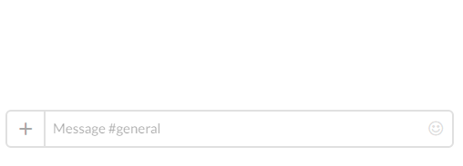
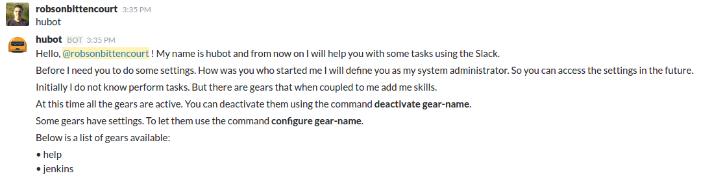
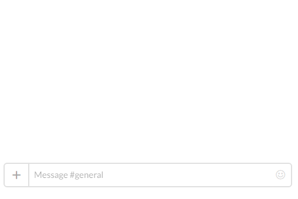
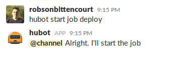
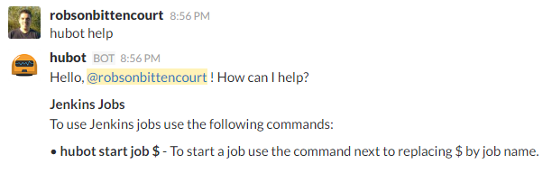

# hubot.js 
[](https://travis-ci.org/hubot-js/hubot.js)   [](https://www.npmjs.com/package/hubot.js)   [](https://coveralls.io/github/hubot-js/hubot.js?branch=master)   [](https://codeclimate.com/github/hubot-js/hubot.js)  [](https://david-dm.org/hubot-js/hubot.js)  [](https://david-dm.org/hubot-js/hubot.js?type=dev)  [](https://hub.docker.com/r/robsonbittencourt/hubot.js/)  [](https://hub.docker.com/r/robsonbittencourt/hubot.js/)  [](http://microbadger.com/images/robsonbittencourt/hubot.js)

> A small robot written in Javascript (He doesn't like coffeescript)

## Hello world

Hello! My name is Hubot. I'm a robot and my job is to do stuff in Slack chats. At first, I don't know many things, but when gears are attached everything is possible. I love new gears. Feel free to create them.



## How to turn me on?

The first step is to have a bot user in Slack. If you don't have a bot yet [click here](https://api.slack.com/bot-users) to create one. With a bot user created get the token that was generated in the bot creation and go to the next step.

### npm

Very simple. Run the command below.

```bash
npm install -g hubot.js
```

### Docker

To enable me with Docker it's a piece of cake. I have a recipe of how to build me in [Dockerhub](https://hub.docker.com/r/robsonbittencourt/hubot.js/). Just run the following command:

```bash
docker run -d -e BOT_API_TOKEN=bot_token \
              -e BOT_NAME=bot_name \
              --name=hubot \
              robsonbittencourt/hubot.js
```

## Usage

After you install me through npm some commands are avaliable in your command line. If you start me with Docker these commands won't are available. Help and configure are commands exclusively for console with npm installation. The other commands can be executed with Docker commands - like docker start/stop/restart.

### CLI Commands Overview 

```bash
# Show the help with available commands
$ hubot help                              

# Saves the required settings. These settings are stored, so you just need to do them once.
# But if necessary can make them again.
$ hubot configure -t botToken -n botName  

# Start the hubot. To use this command, the settings must have been already set up.
$ hubot start                             

# Start the hubot. This command saves the configuration and starts. 
$ hubot start -t botToken -n botName      

# Stop the hubot.
$ hubot stop                              

# Restart the hubot.
$ hubot restart                           
```

### First iteration

After you start me call me by my name in private chat. With this I show to you some first instructions.



**_An important detail. To ask me things on a channel I have to be participating in it._**

### Activate/Deactivate Gears

You don't want to use some gear? You can disable it. If you want to activate it again it is also possible. Use `activate gear-name` or `deactivate gear-name`.


### Configure Gears

Some gears need to be set up before first use. Use `configure gear-name` command.



## Gears

For now, I don't know how to do many things. But I'm able to understand and to use new gears (features). You can create your own gears. If you think they can be useful for other users, please share it with the world.

### Jenkins

I know how to invoke your jobs in Jenkins. For this, you need to do the setup before.

```
configure jenkins
```

After that, you can ask me to do your jobs.

```
hubot start job my-deploy
```



### Help

If you have doubt about the available commands, please ask me for help. I'll be glad to use my gears and knowledge to answer your questions.

```
hubot help
```



## Development setup
- Fork and clone this project
- In the main directory run ```npm install```to install dependencies.
- Write your code
- To run tests use ```npm test``` command

## Contributors
[Robson Rosa](https://github.com/robsonrosa)

## Meta
Robson Bittencourt - @rluizv - robson.luizv@gmail.com

Distributed under the MIT license. See [LICENSE](LICENSE) for more information.

https://github.com/hubot-js/hubot.js
